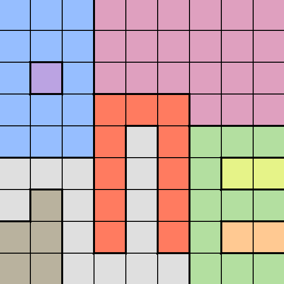
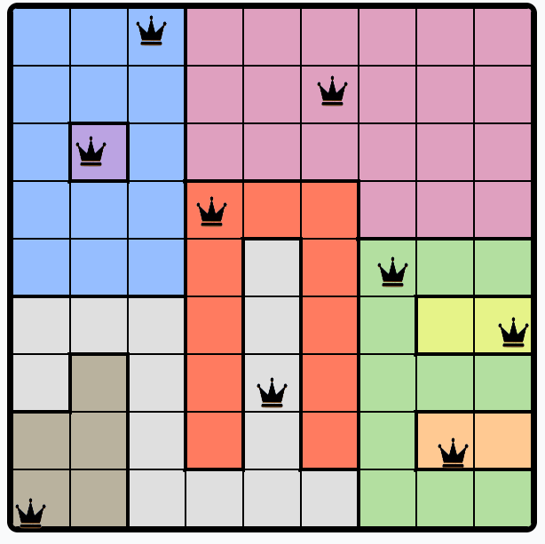
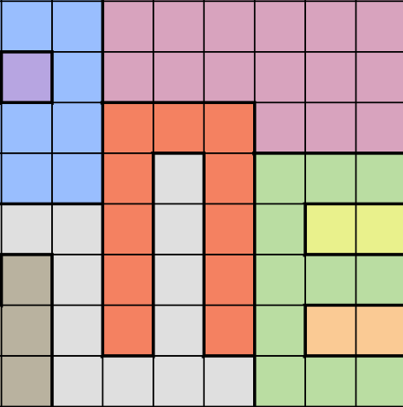
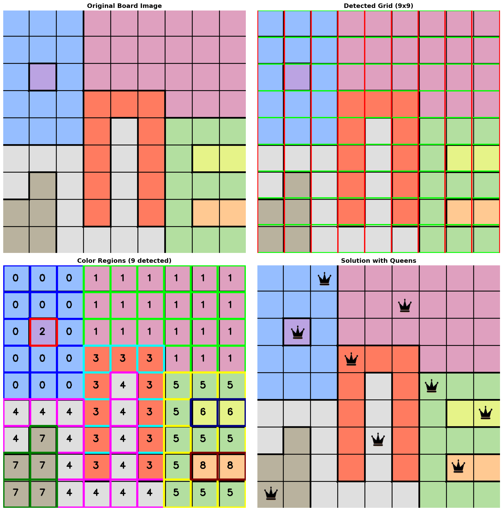

# 👑 Queens Puzzle Solver

A sophisticated computer vision system for automatically solving colored queens puzzles from images. Combines intelligent image processing with optimized constraint satisfaction algorithms to detect puzzle boards and find valid queen placements.


## What is a Queens Puzzle?

The Queens puzzle is a constraint satisfaction problem popularized as a daily logic game on LinkedIn. The objective is to place queens on a colored grid so that:

- **One queen per row, column, and colored region**
- **No adjacent queens** (including diagonally)
- **Each colored region contains exactly one queen**

## ✨ Features

- 🔍 **Smart Board Detection** - Automatically detects board size and grid structure
- 🎨 **Advanced Color Recognition** - Intelligent clustering of colored regions
- 🧠 **Optimized Backtracking** - Classical constraint satisfaction with pruning
- ⚡ **Lightning Fast** - Solves most puzzles in milliseconds
- 🎯 **High Accuracy** - Robust validation and error detection

## 🚀 Quick Start

### Installation

```bash
# Clone and setup
git clone https://github.com/santipvz/queen_solver
cd queens_solver
python3 -m venv .venv
source .venv/bin/activate  # Linux/Mac
pip install -r requirements.txt
```

### Basic Usage

```bash
# Solve a puzzle
python3 main.py path/to/your/board.png

# Custom output directory
python3 main.py board.png --output results/

# Quiet mode
python3 main.py board.png --quiet
```

## 📸 Examples

### ✅ Solvable Puzzle

| Original Board | Solution Found |
|---|---|
|  |  |

*9x9 board with 9 colored regions - **Solution found in 0.002s***

### ❌ Unsolvable Puzzle

| Original Board | Analysis |
|---|---|
|  | *No valid solution exists due to region constraints* |

*8x8 board with 7 regions - **Mathematically impossible***

### 📊 Detailed Analysis



*4-panel analysis showing: original image, grid detection, region extraction, and final solution*

## 🧪 Testing

### Run All Test Cases

You can test the solver with all the puzzle boards in the test directory:

```bash
# Run tests on all board examples
python3 -m pytest tests/ -v
```

The test suite includes:
- **Solvable puzzles** - Various board sizes and configurations
- **Unsolvable puzzles** - Edge cases and impossible configurations


